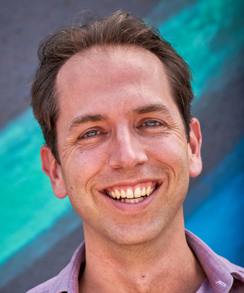

Workshop Schedule
+++++++++++++++++

HPPSS will take place on Monday, November 18th from 2 PM - 5:30 PM ET. More details to come!

Matt Rocklin (Dask/Coiled) - Invited Speaker
============================================

Matthew is an open source software developer in the Python data ecosystem. He maintains several PyData libraries, 
but today focuses mostly on Dask, a library for parallel computing. Matthew worked for Anaconda for several years, 
and then NVIDIA before going on to found Coiled, a company focused on large scale computing in the cloud.
Matthew holds a bachelors degree from UC Berkeley in physics and mathematics, and a PhD in computer science from 
the University of Chicago.

